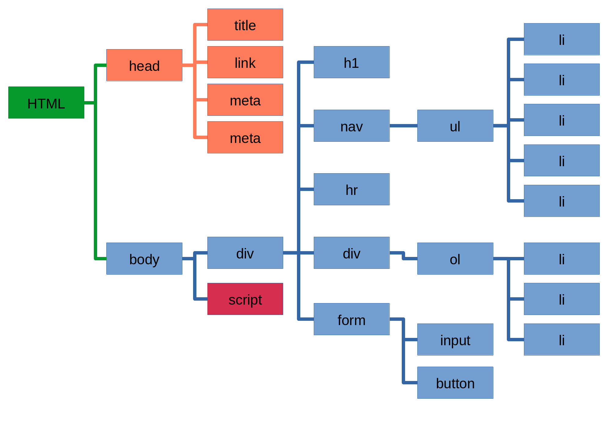

# DOM Manipulation Lesson

How can we use JavaScript to manipulate HTML pages in our browser?

Create a folder for this lesson.


## The HTML and CSS

**EITHER** clone [this repository](https://github.com/IngeborgSlegers/HP_DOM_Manipulation) **OR** make the HTML and CSS files as below.

Create a new file called `index.html` containing the following:

```html
<!DOCTYPE html>
<html lang="en">
<head>
  <meta charset="UTF-8">
  <meta name="viewport" content="width=device-width, initial-scale=1.0">
  <meta http-equiv="X-UA-Compatible" content="ie=edge">
  <title>Newt's Magical To-Do List</title>
  <link rel="stylesheet" href="index.css">
</head>
<body>
  <div id="list">
    <h1 id="listTitle">Newt's Magical To-Do List</h1>
    <div id="toDoDiv">
      <ul>
        <li class="listItem">Write article on Grindylows</li>
        <li class="listItem">Return treasure stolen by Niffler</li>
        <li class="listItem">Study Occamy's eggs</li>
        <li class="listItem">Feed Erumpents</li>
        <li class="listItem">Visit Jacob</li>
      </ul>
    </div>
    <hr />
    <div id="groceryDiv">
      <ul id="groceryList">
        <li class="groceryItem">Gillyweed</li>
        <li class="groceryItem">Flobberworm Mucus</li>
        <li class="groceryItem">Boom Berry juice</li>
      </ul>
    </div>
    <div id="inputfield">
      <input type="text" id="listInput" placeholder="Next to do item">
      <button id="clickMe">ADD</button>
    </div>
  </div>
  <script src="index.js"></script>
</body>
</html>
```

Now create a file called `index.css` containing this:

```css
#list{
	position: relative;
	width: 500px;
	padding: 30px 50px;
	margin: 0 auto;
	background-color: #fff;
	-webkit-box-shadow: 0 0 4px rgba(0, 0, 0, 0.2), inset 0 0 50px rgba(0, 0, 0, 0.1);
	-moz-box-shadow: 0 0 4px rgba(0, 0, 0, 0.2), inset 0 0 50px rgba(0, 0, 0, 0.1);
	box-shadow: 0 0 5px rgba(0, 0, 0, 0.2), inset 0 0 50px rgba(0, 0, 0, 0.1);
}

input{
	border-radius: 1em;
	height: 2em;
	width: 30em;
	margin: 4px;
}

#inputfield button {
	border-radius: 1em;
	height: 2.5em;
	width: 5em;
	margin: 1em;
}
```

**FINALLY**, whether you cloned the repo or not, create a blank `index.js` file. Then open up `index.html` in your browser.


## What is the DOM?

Now that we know how to work with HTML/CSS and JavaScript by themselves, it's time for us to start combining the two realms.

***Q.*** What does DOM stand for?  
***A.*** *Document Object Model*


## Selecting Elements

With `index.html` open in the browser, open the developer tools and then go to the *console*.

Let's start by grabbing a single element from our HTML page.

```js
let listTitle = document.getElementById('listTitle');

console.log(listTitle);
```

You should see the `h1` element printed out to the console.
What this means is that we can select elements from the HTML, store them in variables, and use JavaScript to manipulate them.

Here's another method of `document` you can use to select items:

```js
let listItem = document.querySelector('ul li');

console.log(listItem);
```

This will return the *first* element that matches the CSS selector you give it, so here, you can see it returns the first `li` in our unordered list.
Note that the argument to `.querySelector` can be any CSS selector, so you could use `.class` or `#id` as well, although for those cases you will usually use `.getElementById` or its class equivalent.


Now that we have the title and a list item in variables, we can use JS to style them.

```js
listTitle.style.textAlign = 'center';

listItem.style.color = 'red';
```

Notice, this is just dot notation!
- Because HTML elements on our page are represented as objects in JS, we can use dots to dig into them and modify properties.
- Here, we see that the `style` key in the `listTitle` object has the value of an object, which has a `textAlign` key that we set to be the string `'center'`.
- Every HTML element that you grab will have a `style` object inside of it that you can modify like this.
- Just be sure to use camelCase for property names instead of hyphens.


## Accessing multiple elements

- When accessing multiple elements, either a `NodeList` or an `HTMLCollection` is returned. 
- It is not an array but it works like one.
  - So, you can loop through it and use the length property to get the size. 
  - They are both iterables, technically speaking.
- If you want to get a specific element you can either use square-bracket array notation or the `.item` method.

What is returned depends on what method we use:
- `.getElementsByClassName` returns an `HTMLCollection`
- `.getElementsByTagName` returns an `HTMLCollection`
- `.querySelectorAll` returns a `NodeList`

These methods in action:

```js
let groceries = document.getElementsByClassName('groceryItem');

console.log(groceries);          // (prints the HTMLCollection)
console.log(groceries.length);   // 3
console.log(groceries[2]);       // (prints the third li element)
console.log(groceries.item(2));  // (also prints the third li element)


let liTags = document.getElementsByTagName('li');

console.log(liTags);             // (prints an HTMLCollection)


let selectAll = document.querySelectorAll('ul li');

console.log(selectAll);          // (prints a NodeList)
```


Take a few minutes to research what the difference is between an `HTMLCollection` and a `NodeList`.
It might help to figure out what exactly a "node" is.


## The DOM tree




